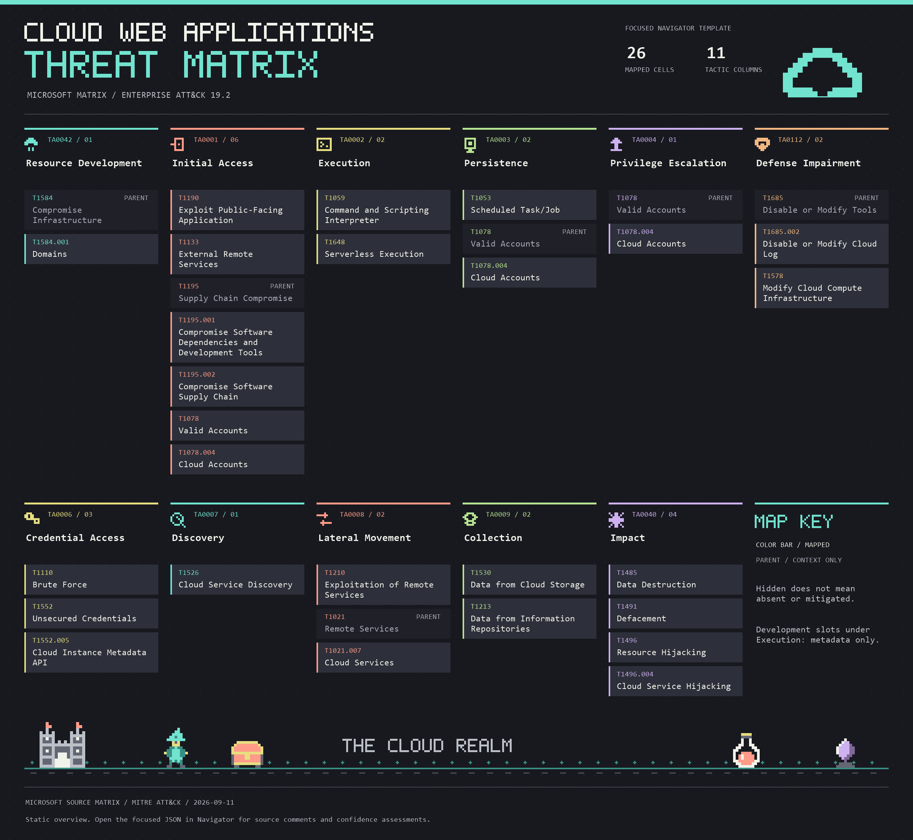

# Cloud Web Application Threat Matrix: ATT&CK Navigator Mapping

*Click the image for the full-size overview. Colors distinguish tactics, not severity or confidence; parent cards provide context only. The interactive Navigator layers are linked below.*

This is my personal project to bring [Microsoft's Cloud Web Applications Threat Matrix](https://microsoft.github.io/Threat-Matrix-for-Cloud-Web-Applications/) into ATT&CK Navigator. The idea is to make the matrix easier to explore alongside Enterprise ATT&CK, while keeping track of where the two don't line up neatly.

It's not an official Microsoft or MITRE project, and neither organization is affiliated with or endorses it.

The matrix was extracted on **2026-09-11** and mapped against **Enterprise ATT&CK 19.2**.

## Try the Layer

Start with the [Navigator layer JSON](microsoft-cloud-web-applications.navigator.json). In [ATT&CK Navigator](https://mitre-attack.github.io/attack-navigator/), choose **Open Existing Layer**, then **Upload from local**, and select the file.

For a focused threat-modelling view, open the [alternative template](microsoft-cloud-web-applications.focused.navigator.json) the same way. It keeps the 26 mapped cells and their comments, uses flat layout, and hides all other technique/tactic cells and empty tactic columns. Navigator retains grey parent labels where needed to display mapped sub-techniques. Development slots under Execution remains in metadata, not a matrix cell. Hidden techniques are outside this view, not assessed as absent or mitigated.

To retain the focused view when exporting your working copy, leave **Only download annotations on visible techniques** unchecked. The disabled entries must stay in the JSON so Navigator does not re-enable them on import.

There are two supporting files if you'd like to look closer:

- [Mapping report](mapping-report.md): the full table, why each mapping was chosen, alternatives, and entries left unmapped.
- [Mapping inventory](mapping-inventory.json): the same mapping results in a machine-readable format for reuse.

## What's Included

| Measure | Count |
|---|---:|
| Original Microsoft tactics | 11 |
| Distinct source technique names | 31 |
| Original tactic/technique placements | 35 |
| Mapped source technique names | 31 |
| Mapped placements | 34 |
| Custom source technique names | 1 |
| Custom placements | 1 |
| Distinct active ATT&CK IDs | 24 |
| Navigator annotations | 26 |

Some techniques appear under more than one Microsoft tactic, which is why there are 35 placements but 31 distinct names. Where multiple entries map to the same ATT&CK technique and tactic, they share a Navigator cell. The comments keep the original names and placements together.

Development slots is partially mapped, so it appears in both the mapped-name and custom-name counts. Those counts overlap by one; the 34 mapped placements and one custom placement still account for all 35 source placements without duplication.

Every mapped annotation is enabled and has a score of `1`. That just means "included in this mapping," not a severity rating or confidence score.

## A Few Mapping Choices

Microsoft provides ATT&CK references for 20 of the technique names. This project adds mappings for eleven more names based on the described behavior, including the partially mapped Development slots entry. The report distinguishes those additions from Microsoft's references and explains the alternatives. The High and Medium confidence labels are assessments made for this project, not official MITRE ratings.

Application exploit (RCE) is mapped to `T1190` with **Medium** confidence for the public-facing initial-access scenario. The web service can also be private; that case is not covered by `T1190` just because remote code execution occurs. The layer comments and report make this limitation explicit and preserve Microsoft's original Execution tactic.

Exposed/misconfigured admin interfaces is mapped to `T1133` with **Medium** confidence when an externally reachable administrative interface is used to gain access. Exposure alone is not an attack, and private-only interfaces are outside this mapping's scope. The report and comments distinguish this from valid-credential abuse (`T1078`) and exploitation of a public-facing weakness (`T1190`).

Serverless trigger injection is mapped to `T1648` with **Medium** confidence when crafted event inputs cause arbitrary code or commands to execute in a serverless workload. The function can already exist. Simply triggering legitimate processing or causing data access without attacker-controlled code or command execution is outside this mapping's scope. Navigator shows it under Execution; comments retain Microsoft's original Initial Access tactic.

Development slots has a split decision. Its **Defense Evasion** placement maps to `T1578` with **Medium** confidence when an attacker creates or modifies a managed compute deployment configuration to evade defenses. This is our interpretation of the parent technique, not an explicit MITRE slot example or an extension of ATT&CK's official scope. Code edits alone, unchanged staging endpoints, and promotions without an established defense-evasion purpose are excluded. Navigator places this under Defense Impairment; the original **Execution** placement remains custom.

Connector reuse is mapped to `T1021.007` with **Medium** confidence for lateral access to a connected cloud service using a managed connector's stored authenticated identity, without necessarily extracting its credentials. This is our interpretation, not an explicit MITRE connector example. Microsoft's description does not establish the synchronized or federated identity context in ATT&CK's definition, which limits confidence. Non-cloud targets and actions that do not establish access to a connected cloud service are excluded.

Data theft is mapped to `T1530` with **Medium** confidence when data is retrieved from cloud storage used by the application or its connected resources. The source also describes broader application-data retrieval, so this mapping covers only the cloud-storage case. Local files, process memory, and information repositories do not qualify merely because the application is cloud-hosted. This represents collection, not a specified exfiltration channel. Navigator shows it under Collection, sharing a cell with Access to connected cloud storage; the comments preserve both entries and Data theft's original Impact tactic.

Denial of wallet is mapped to `T1496.004` with **Medium** confidence for abuse of a compromised cloud service or SaaS application to perform resource-intensive operations that incur costs or consume service quotas. ATT&CK explicitly recognizes those financial consequences; service unavailability and attacker financial gain are not required. This is a researcher alignment, not an unconditional equivalence: Microsoft's request-flooding and cloud-function examples do not establish SaaS compromise, so increased billing alone is not enough to qualify. The original Impact tactic is retained in Navigator.

One source placement remains **custom**: Development slots under Execution.

No ATT&CK ID was invented for this custom placement. Its explanation is in the report and layer metadata. Development slots is not counted as fully unmapped: only its Execution placement remains custom.

Navigator also has to use ATT&CK's own tactic columns, so the layer isn't a pixel-for-pixel copy of Microsoft's matrix. All 11 original tactics are retained in the report and metadata, but custom entries won't show up as native technique cells. ATT&CK 19 uses Stealth and Defense Impairment in place of the former Defense Evasion taxonomy. The layer also updates Microsoft's revoked logging reference, `T1562.008`, to MITRE's official replacement, `T1685.002`.

Treat this as a reference you can inspect and question, not a promise of complete defensive coverage.

## What Has Been Checked

The layer passed checks for source coverage, active ATT&CK IDs, valid tactic assignments, and JSON format. This exact layer file was imported into **Navigator 5.3.2** on **2026-09-11**, with all **26 expected highlighted cells** rendered in their expected tactic columns. Every tooltip score was `1`, and the full text of all 26 annotation comments matched the prepared file.

Merged source placements, the custom Development slots Execution entry, contributor attribution, and licensing notices were retained in the imported layer. The package was also checked against the research output during preparation. The [mapping report](mapping-report.md) records the tested layer's SHA256 hash; this browser result applies to that exact file, not future revisions. These checks are not MITRE certification or a guarantee of defensive coverage.

The layer uses format **4.5**. Its `attack` version field is `19`, which selects the release family; the mappings were checked against **19.2**. Links to the exact source revisions are in the report.

## Credits and Reuse

ATT&CK mapping and Navigator layer prepared by [jaekk0](https://github.com/jaekk0). My original contributions are licensed under [CC BY 4.0](https://creativecommons.org/licenses/by/4.0/), so others can reuse and adapt them with attribution.

Microsoft's matrix content is also licensed under CC BY 4.0. ATT&CK material keeps MITRE's own license terms. I'm not claiming ownership of, or relicensing, either organization's work.

See [LICENSE](LICENSE) and [third-party notices](THIRD-PARTY-NOTICES.md) for the details. The standalone JSON files also include attribution, modification notices, and MITRE's license and disclaimers so those details stay with the data when it's downloaded separately.